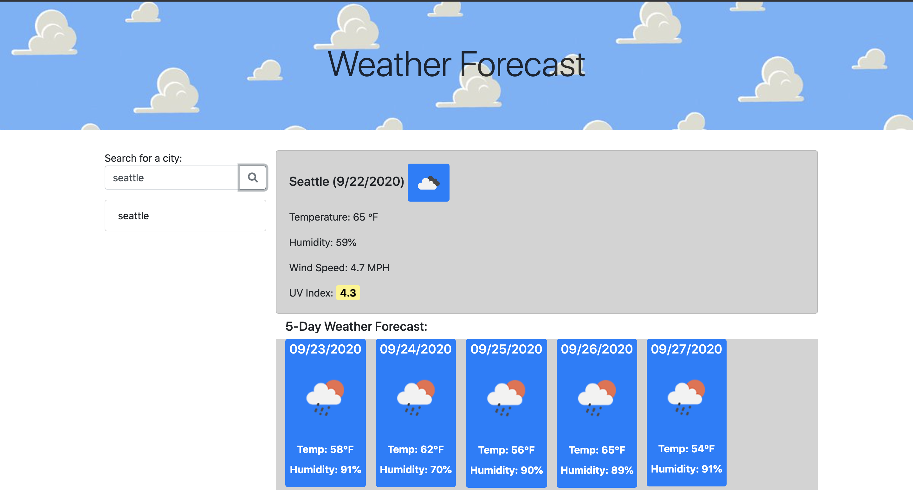

# weather-forecast
1. Added html text to index.html to display content on page
2. created script file to dinamically add more content and append it to the page
3. created CSS file to add customization to uv index response and colors
4. used openweather API for weather data and moment.js to get time for current day and future dates
5. Could not get local storage data items to stay on screen
6. checked files grammar and fixed any misspelled words
7. updated style.css content

# link to deployed website

1. https://jmoarles072095.github.io/weather-forecast/.

# Deployed Website

